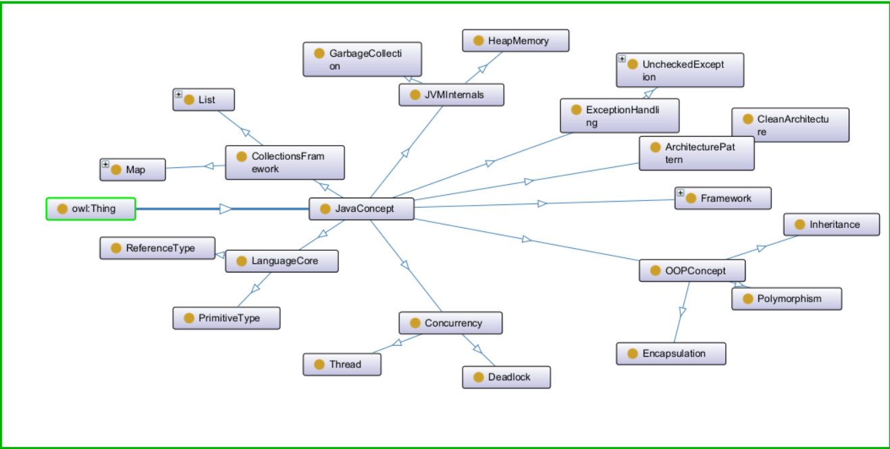

# Java Software Engineering Ontology (JSE-Ontology)

## 1. Motivation

Large Language Models (LLMs) and Retrieval-Augmented Generation (RAG) systems rely heavily on vector similarity, which lacks:

- Structural semantic reasoning
- Hierarchical inference
- Logical consistency enforcement
- Cross-domain dependency modeling

This project introduces a **Java Software Engineering Ontology (JSE-Ontology)** that models the conceptual structure of the Java ecosystem using OWL.

The ontology is designed to serve as the symbolic reasoning layer for an Ontology-Constrained RAG (OC-RAG) system.

---

## 2. Scope

This ontology covers major domains of the Java ecosystem:

- Language Core
- Object-Oriented Programming
- Concurrency & Synchronization
- JVM Internals & Memory Management
- Exception Handling
- Collections Framework
- ORM & Persistence
- Frameworks (Spring, Hibernate)
- Architecture Patterns
- Design Patterns
- Performance Issues

The objective is to provide a structured semantic representation of Java knowledge suitable for:

- Reasoning
- Knowledge graph traversal
- Constraint validation
- Hybrid symbolic-neural retrieval

---

## 3. High-Level Concept Hierarchy

JavaConcept
├── LanguageCore
├── OOPConcept
├── Concurrency
├── JVMInternals
├── ExceptionHandling
├── CollectionsFramework
├── ORMConcept
├── Framework
├── ArchitecturePattern
├── DesignPattern

All major domains inherit from `JavaConcept`, enabling unified reasoning across domains.

---

## 4. Semantic Relationships

The ontology defines object properties such as:

- `causes`
- `dependsOn`
- `implementedBy`

Example:

- `Deadlock causes PerformanceIssue`
- `CleanArchitecture implementedBy SpringFramework`
- `NPlusOneQuery causes PerformanceIssue`

These relationships enable causal reasoning and cross-domain traversal.

---

## 5. Reasoning Capabilities

The ontology supports:

- Subclass inference
- Domain-range validation
- Transitive dependency modeling
- Cross-domain causal reasoning

Example inference:

If:
- NPlusOneQuery ⊆ JavaConcept
- NPlusOneQuery causes PerformanceIssue

Then:
- Any instance of NPlusOneQuery is also inferable as related to PerformanceIssue

This capability is critical for Ontology-Constrained Retrieval systems.

---

## 6. Designed for OC-RAG Integration

This ontology is not a static knowledge map.

It is designed to integrate into a hybrid pipeline:

User Query  
→ Semantic Retrieval (Vector Search)  
→ Ontology Traversal  
→ Constraint Validation  
→ LLM Generation  

Ontology traversal enables:

- Retrieval expansion
- Logical filtering
- Consistency validation
- Structured reasoning

---

## 7. Tools for Testing

Recommended tools:

- Protégé (with HermiT reasoner) — for ontology modeling and inference
- Apache Jena Fuseki — for SPARQL querying
- GraphDB — for knowledge graph exploration

---

## 8. Research Direction

This ontology serves as the symbolic foundation for exploring:

- Neuro-symbolic AI
- Ontology-Constrained RAG
- Logical hallucination reduction
- Structural semantic retrieval

Future work includes:

- SWRL rule integration
- Logical constraint enforcement
- Evaluation framework for consistency scoring
- Hybrid retriever implementation

---

## 9. Why Java as Domain?

Java provides:

- Well-structured conceptual hierarchy
- Rich ecosystem
- Clear domain boundaries
- Real-world engineering relevance

This makes it an ideal domain for studying ontology-enhanced retrieval and reasoning.

---

## 10. Author Vision

This ontology aims to bridge:

Symbolic Knowledge Representation  
and  
Neural Retrieval-Augmented Generation

It represents the symbolic layer of a broader research initiative toward structured AI systems for software engineering knowledge.
